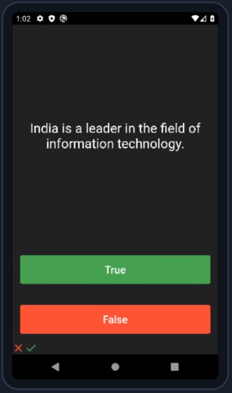

<h1>flutter-04-quiz</h1>

- This is a stateful app which is a True False based quiz.
- It is fully Object Oriented based app which means all 4 pillars(AEIP) of OOPS is implemented.

## The app

----

List of all Flutter apps: <a href="https://github.com/Rahullkumr/Flutter-Projects-List">click here</a>
